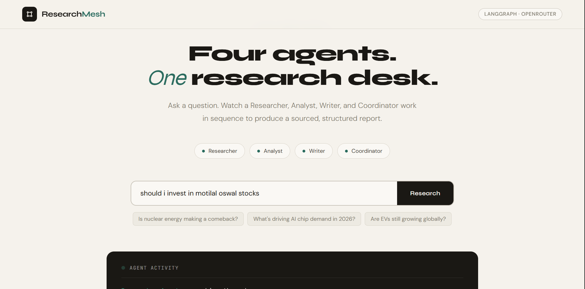
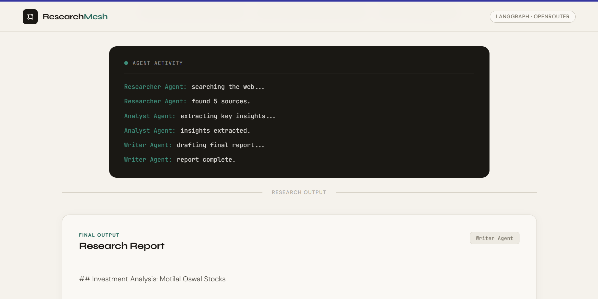
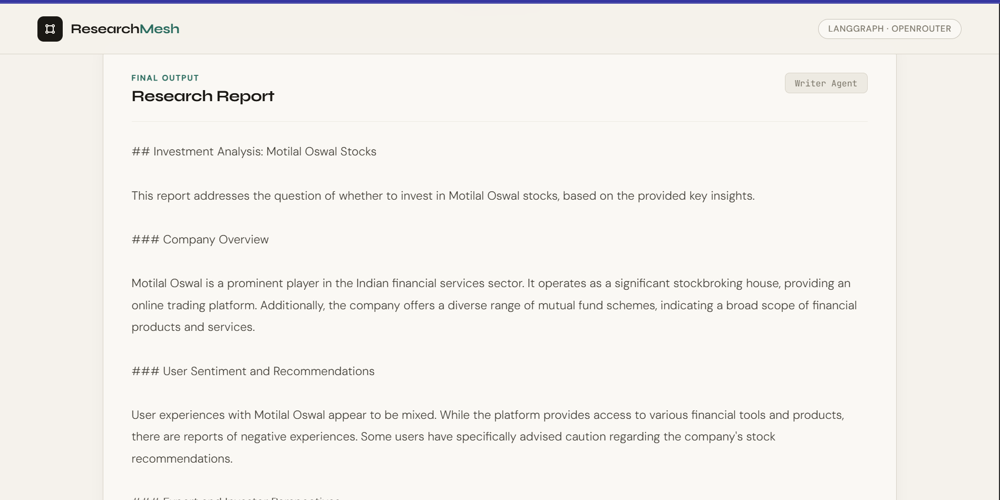
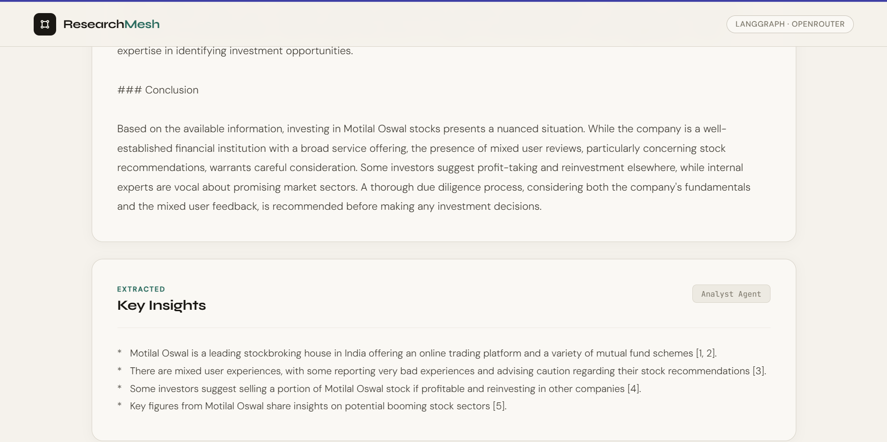
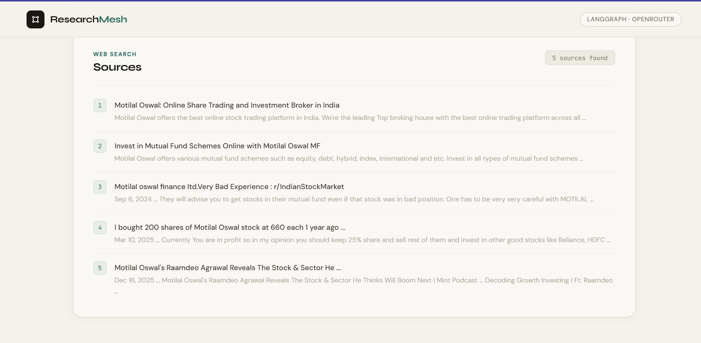

# ResearchMesh — Multi-Agent Research System

> Four specialized AI agents working in sequence to transform a question into a sourced, structured research report.



---

## Overview

ResearchMesh is a multi-agent AI system that answers research questions by coordinating four specialized agents — a **Researcher**, an **Analyst**, a **Writer**, and a **Coordinator** — each with a single, narrow responsibility. Rather than asking one AI to search, analyze, and write all at once, the work is split across a pipeline, with each agent's output feeding directly into the next.

Built as part of the **AI Mastery Roadmap**, this project demonstrates the core pattern behind modern production AI systems: structured division of labor between agents, orchestrated using **LangGraph**, with real-time visibility into what each agent is doing as it works.

---

## Why Multi-Agent Instead of One LLM Call?

A single prompt asking an LLM to "research this, analyze it, and write a report" tends to blend all three jobs together — quality drops because the model is juggling instructions at once, and there's no guarantee it actually searched for real information instead of generating plausible-sounding text.

Splitting the work across agents enforces structure at the code level:

- The **Researcher** is forced to call a real web search tool — it cannot skip straight to writing
- The **Analyst** only ever sees raw search results, never the original question's "vibe" — its only job is extracting facts
- The **Writer** only ever sees the Analyst's clean insights, never the noisy raw search data — its only job is composing a clear report

Each agent has a narrower job than a single end-to-end prompt, which makes its output more reliable and easier to debug.

---

## How It Works — Flow Diagram

```
                              ┌─────────────────────┐
                              │      USER INPUT      │
                              │  "Should I invest    │
                              │  in renewable energy  │
                              │      stocks?"         │
                              └──────────┬───────────┘
                                         │
                                         ▼
                              ┌─────────────────────┐
                              │   FASTAPI BACKEND    │
                              │   POST /research      │
                              └──────────┬───────────┘
                                         │
                                         ▼
                         ┌───────────────────────────────┐
                         │      LANGGRAPH WORKFLOW        │
                         │   (shared state flows through)  │
                         └───────────────┬───────────────┘
                                         │
              ┌──────────────────────────┼──────────────────────────┐
              │                          │                          │
              ▼                          ▼                          ▼
   ┌─────────────────────┐   ┌─────────────────────┐   ┌─────────────────────┐
   │   RESEARCHER AGENT   │   │    ANALYST AGENT      │   │    WRITER AGENT       │
   │                      │   │                       │   │                       │
   │  Calls DuckDuckGo     │──▶│  Reads raw search      │──▶│  Reads Analyst's       │
   │  web_search() tool    │   │  results               │   │  insights only         │
   │                      │   │                       │   │                       │
   │  Returns: title,      │   │  Extracts key bullet    │   │  Writes a polished,    │
   │  snippet, url for      │   │  point insights         │   │  structured final      │
   │  each source           │   │  grounded in sources    │   │  report                │
   └─────────────────────┘   └─────────────────────┘   └─────────────────────┘
              │                          │                          │
              └──────────────────────────┼──────────────────────────┘
                                         │
                                         ▼
                              ┌─────────────────────┐
                              │   COORDINATOR/STATE   │
                              │   Final state holds:  │
                              │   - report             │
                              │   - insights            │
                              │   - sources             │
                              │   - activity_log         │
                              └──────────┬───────────┘
                                         │
                                         ▼
                              ┌─────────────────────┐
                              │     JSON RESPONSE      │
                              │   returned to browser  │
                              └──────────┬───────────┘
                                         │
                                         ▼
                              ┌─────────────────────┐
                              │   FRONTEND DISPLAY     │
                              │  - Live agent activity  │
                              │  - Final report          │
                              │  - Key insights           │
                              │  - Clickable sources       │
                              └─────────────────────┘
```

### State flow in detail

Every agent reads from and writes to a single shared `AgentState` object as it passes through the LangGraph pipeline:

```
AgentState {
  question: str            ← set once, at the start
  raw_results: list        ← written by Researcher
  research_text: str       ← written by Researcher
  insights: str            ← written by Analyst, reads research_text
  report: str              ← written by Writer, reads insights
  activity_log: list       ← appended to by every agent
}
```

This is what makes the system genuinely a **pipeline** rather than three disconnected function calls — each node receives the full state, modifies only its part, and passes the whole thing forward.

---

## Screenshots

### Landing Page — Agent Roster & Input


### Live Agent Activity Panel


### Final Research Report


### Key Insights — Analyst Output


### Sources — Researcher Output


---

## Features

- Ask any research question and receive a structured, sourced report
- Real-time activity feed showing each agent's status as it works
- Grounded answers — the Writer never invents facts, it only rephrases the Analyst's insights, which come only from real search results
- Clickable source links so the user can verify every claim
- Clean separation of concerns across four distinct agent roles
- Built on LangGraph — a production-grade agent orchestration framework

---

## Tech Stack

| Layer | Technology | Purpose |
|---|---|---|
| Agent Orchestration | `LangGraph` | Defines agents as nodes in a state graph, manages execution order |
| LLM | `OpenRouter` (`openrouter/auto`) | Powers the Analyst and Writer agents' reasoning and writing |
| Web Search | `ddgs` (DuckDuckGo Search) | Gives the Researcher agent real-time access to live web data |
| Backend | `FastAPI` | Exposes the `/research` endpoint, orchestrates the pipeline |
| Frontend | HTML / CSS / JS | Live activity terminal + structured report display |
| Environment | `python-dotenv` | Secure API key management via `.env` |

---

## The Four Agents

### 1. Researcher Agent
**Job:** Find real information.
Calls the `web_search()` tool (DuckDuckGo) with the user's question and returns up to 5 sources — each with a title, snippet, and URL. This agent does no reasoning; its only job is retrieval.

### 2. Analyst Agent
**Job:** Extract what matters.
Reads the raw search results and produces a concise bullet list of the most relevant insights. It is explicitly instructed not to write prose or a full report — only extraction.

### 3. Writer Agent
**Job:** Communicate clearly.
Takes the Analyst's bullet-point insights and composes a structured, professional report with headers and short paragraphs. It never sees the raw search data directly — only the Analyst's distilled output.

### 4. Coordinator (implicit via LangGraph)
**Job:** Orchestrate the pipeline.
Rather than a separate LLM call, the Coordinator role is implemented as the LangGraph state machine itself — it defines the entry point, the edges connecting each agent, and ensures state flows correctly from Researcher → Analyst → Writer → end.

---

## Project Structure

```
multi-agent-research-system/
│
├── main.py              # FastAPI app — /research endpoint + static file serving
├── agents.py            # Agent definitions + LangGraph workflow construction
├── tools.py             # DuckDuckGo web search tool used by the Researcher agent
│
├── static/
│   └── index.html       # Complete frontend (HTML + CSS + JS) with live activity panel
│
├── screenshots/         # README screenshots
├── .env                 # API keys (not committed to GitHub)
├── .gitignore           # Excludes venv, .env, __pycache__
└── README.md            # This file
```

---

## Getting Started

### Prerequisites

- Python 3.10+
- A free [OpenRouter](https://openrouter.ai) API key

### Installation

```bash
# Clone the repository
git clone https://github.com/goelavi04/multi-agent-research-system.git
cd multi-agent-research-system

# Create and activate virtual environment
python -m venv venv
venv\Scripts\activate        # Windows
source venv/bin/activate     # macOS / Linux

# Install dependencies
pip install fastapi uvicorn langgraph langchain langchain-openai ddgs python-dotenv requests
```

### Configuration

Create a `.env` file in the root directory:

```
OPENROUTER_API_KEY=your_key_here
```

### Running the App

```bash
python -m uvicorn main:app --reload
```

Open your browser and navigate to:

```
http://localhost:8000
```

---

## Usage

1. Type a research question into the input field — e.g. *"What's driving AI chip demand in 2026?"*
2. Click **Research**
3. Watch the live agent activity panel as the Researcher, Analyst, and Writer work in sequence
4. Review the final report, the Analyst's key insights, and the list of clickable sources

---

## API Reference

### `POST /research`

Runs the full multi-agent pipeline on a research question.

**Request body:**
```json
{
  "question": "Should I invest in renewable energy stocks?"
}
```

**Response:**
```json
{
  "question": "Should I invest in renewable energy stocks?",
  "report": "## Investment Analysis...",
  "insights": "* Key insight one...\n* Key insight two...",
  "sources": [
    { "title": "...", "snippet": "...", "url": "..." }
  ],
  "activity_log": [
    "Researcher Agent: searching the web...",
    "Researcher Agent: found 5 sources.",
    "Analyst Agent: extracting key insights...",
    "Analyst Agent: insights extracted.",
    "Writer Agent: drafting final report...",
    "Writer Agent: report complete."
  ]
}
```

**Error responses:**
- `400` — Empty question
- `500` — Internal server error (LLM or search failure)

---

## Dependencies

```
fastapi
uvicorn
langgraph
langchain
langchain-openai
ddgs
python-dotenv
requests
```

---

## Known Limitations

- DuckDuckGo search results can occasionally be rate-limited on rapid successive requests
- Report quality depends entirely on the quality and relevance of the top 5 search results
- No retry logic yet if the Researcher agent finds zero sources
- All agents currently share the same model (`openrouter/auto`) — a cost-optimized version could route the Researcher's lighter tasks to a cheaper model

---

## Future Improvements

- Add a Coordinator agent that can dynamically decide to re-run the Researcher if sources are insufficient
- Support multi-turn follow-up questions that retain context from the previous report
- Add citation markers directly inline in the Writer's report, linked to specific sources
- Allow per-agent model selection for cost optimization

---

## Author

**Aviral Goel** — [github.com/goelavi04](https://github.com/goelavi04)

---

## License

MIT License — free to use, modify, and distribute.